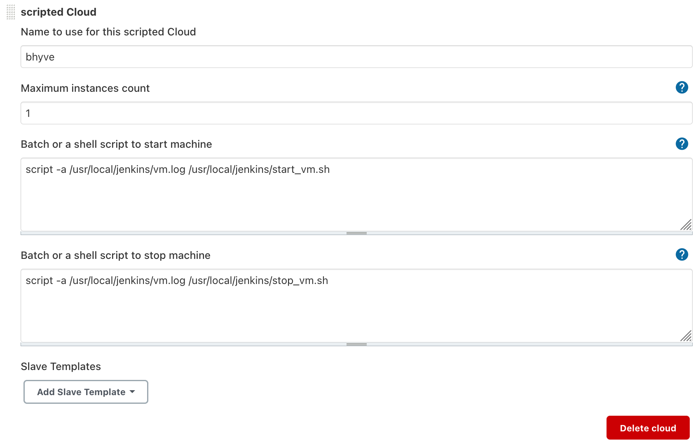

### Using Scripted Cloud

Place the `start_vm.sh` and `stop_vm.sh` scripts in `/usr/local/jenkins/`.

Under *Manage Jenkins* -> *Manage Nodes and Clouds* -> *Configure Clouds* configure it like so:

Then click Save.

Navigate to *New Node* and configure it like so:

